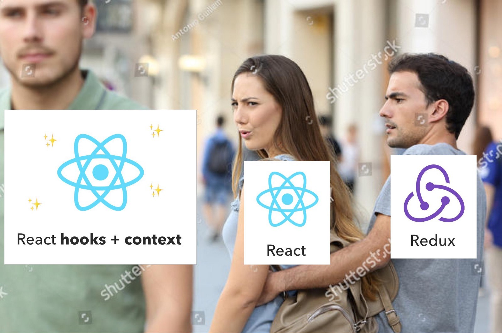

# You Don't Need Redux

originally from Richard Oliver Bray


If you’ve been in the React world for a decent amount of time you would have heard about Redux. Redux is cool, it’s a way of getting separate components to alter and pull data from the main application store, but it’s not easy to pick up, especially for beginners.

There are these things called reducers, actions, and action creators. There are methods like mapDispatchToProps and mapStateToProps as well as a bunch of files and folders that need to be created for conventional reasons. For just sharing and changing data it is a lot of work.

With the introduction of the Context API and hooks, we can sort of recreate Redux in our React app without actually installing redux and react-redux. I will attempt to show you how in this article.

## What we’re building

We’re going to build a tiny app that lates you pick your favourite Rick and Morty episodes This isn’t a tutorial on CSS so we won’t focus much on styling. The full final project is here on Github or here in Codesandbox, feel free to reference it if you get lost.


Note: If you just want the steps and not the explanations, just follow the bullet points.

## The Setup

Make sure you have Nodejs installed on your machine (I’m using version 10.12.0) and we’ll put the app together using,
create-react-app:
`$ npx create-react-app no-redux`

Once it’s done, start it by running `$ npm start` in the no-redux directory.
Then open the package.json file. Your version of react and react-domshould be above 16.7.0 to use hooks, if not install the newer version by running.

`$ npm i react@16.8.0-alpha.1 react-dom@16.8.0-alpha.1`

- To avoid confusion let’s delete these files from src/ App.css, App.test.js, logo.svg, and serviceWorker.js.
- In our index.js and remove line 3, 5, and everything below line 8.
- Rename App.js to App.jsx. Delete everything and replace it with this:

```javascript
import React from "react";

export default function App() {
  return (
    <React.Fragment>
      <div>
        <h1>Rick and Morty</h1>
        <p>Pick your favourite episodes</p>
      </div>
    </React.Fragment>
  );
}
```

## The Redux principles

According to its documentation Redux can be described in three fundamental **principles**, **stores**, **actions**, and **reducers**.

- An action is the only thing that should trigger a state change. It typically returns an object with a type and a payload.

  ```javascript
  function actionFunc(dispatch) {
    return dispatch({ type: "COMPLETE_TODO", payload: 1 });
  }
  ```

  The dispatch argument here tells the action what store this reducer the object needs to affect as an application can have multiple reducers. This will make sense later on.

- A reducer specifies what part of the store will be affected by the action. Because redux stores are immutable, reducers return a new store that replaces the current one. Reducers are typically written as switch statements.

  ```javascript
  function visibilityFilter(state, action) {
    switch (action.type) {
      case "SET_VISIBILITY_FILTER":
        return action.payload;
      default:
        return state;
    }
  }
  ```

- The store holds all the application data in an object tree. Redux has one store but other state managers like Facebook’s Flux, can have multiple stores. If you’re familiar with React think of the store as state, but for the whole application.

  ```javascript
  {
  visibilityFilter: 'SHOW_ALL',
  todos: [
    {
      text: 'Consider using Redux',
      completed: true,
    }
  ]
  }
  ```

- Our component or any component in our application has access to the store and can change the store by triggering an action.

## Creating our Store

- Create a new file in src/ called Store.js

Here we’re going to use react context to create a parent component that will give it’s child components access to the data it holds. I won’t go much into context but essentially is has a provider-consumer relationship. The provider has all the data and the consumer consumes it (makes sense).

- Add the following code to your Store.js file

```javascript
import React from "react";

export const Store = React.createContext();

const initialState = {};

function reducer() {}

export function StoreProvider(props) {}
```

Line 3 creates our context object which children components will subscribe to. For now, let’s skip the inisitalState object and reducer function and go to StoreProvider.

This will be the react component that will encapsulate the other components in the application. It has an argument of props because that’s how we’ll get access to the other child components.

- Add this code to the StoreProvider function

```javascript
export function StoreProvider(props) {
return <Store.Provider value='data from store'>{props.children
</Store.Provider>
}
```

Now go to your index.js file and import StoreProvider from ./Store
import { StoreProvider } from './Store';

Still in index.js, nest your `<App />` component in `<StoreProvider>` your code should look like this

```javascript
ReactDOM.render(
  <StoreProvider>
    <App />
  </StoreProvider>,
  document.getElementById("root")
);
```

- In your App.jsx file import, your Store context below the React import.

```javascript
import { Store } from './Store';
On the first line inside the App function, add
const store = React.useContext(Store);
```

We’re using our first hook here, the useContext one. This will give the component access to the data in the value attribute of our context provider.

- On the first line inside <React.Fragment> add {console.log(store)}
- Now when you run the app and look in the dev tools inspector, you should see some data from your store.

Data from the store in your console
If you’re not getting this don’t panic. Let’s make sure we’ve got the same code.

File Structure:

What your file structure should look like at this point

1. Code Structure:

```javascript
// index.js

import React from "react";
import ReactDOM from "react-dom";
import App from "./App";
import { StoreProvider } from "./Store";

ReactDOM.render(
  <StoreProvider>
    <App />
  </StoreProvider>,
  document.getElementById("root")
);

// Store.js

import React from "react";

export const Store = React.createContext();

const initialState = {};

function reducer() {}

export function StoreProvider(props) {
  return (
    <Store.Provider value="data from store">{props.children}</Store.Provider>
  );
}

// App.jsx

import React from "react";
import { Store } from "./Store";

export default function App() {
  const store = React.useContext(Store);

  return (
    <React.Fragment>
      {console.log(store)}
      <div>
        <h1>Rick and Morty</h1>
        <p>Pick your favourite episodes</p>
      </div>
    </React.Fragment>
  );
}
```

Note: You’ll notice I’m using syntax React.Fragment and React.useContext instead of importing them directly like import React, {Fragment} from ‘react’. This is because we will move and change a lot of the code during refactoring, so please try to follow along with me for now.

## Creating our Reducer

If you’ve been following along or have looked at the code snippet above, you’ll notice we’ve already started putting in some code for our reducer. Let’s flesh that code out.

- In our Store.js file add this code to your empty initialState object

```javascript
const initialState = {
  episodes: [],
  favourites: []
};
```

This is what our initial store will look like before any new bits of data are added.

- Amend the reducer function to look like this

```javascript
function reducer(state, action) {
  switch (action.type) {
    case "FETCH_DATA":
      return { ...state, episodes: action.payload };
    default:
      return state;
  }
}
```

The reducer function as seen previously takes two arguments, state — the data in the store at the time it’s run, and action — the action object that is returned. Currently, our reducer has one case, ‘FETCH_DATA’ which will replace our episodes array with the data that is passed back. The default keyword returning state is needed just in case an invalid action is dispatched.

In our StoreProvider function, add these lines above the return keyword

```javascript
const [state, dispatch] = React.useReducer(reducer, initialState);
const value = { state, dispatch };
```

We’re using our second hook, the useReducer one. This takes two arguments, our reducer, and our intialState. It returns to us an array with state — the data in the store, and dispatch — how we dispatch an action to our reducer (and in turn change our state). I hope this is making sense. Feel free to refer to the redux principles diagram which should help.

We then turn our new state and dispatch variables into an object and assign it to a variable called value. Essentially value is the same as

```javascript
const value = {
  state: state,
  dispatch: dispatch
};
```

But can be written shorter in Javascript ES6 and above.

- In the Store.Provider replace the value='data from store' attribute with

```javascript
value = { value };
```

Now we can pass our state and dispatch to our child component.

- Go to your App.jsx file and change const store = React.useContext(Store) to

```javascript
const { state, dispatch } = React.useContext(Store);
```

- Now update the store in the console log to state and take a look at the console.

You should see it’s pulling our initialState data from Store.jsx. Now let’s work on putting some data in there.

Note: Don’t worry about the dispatch variable not being used at the moment, we will take care of that now.

## Creating our Action

The final piece to our redux puzzle.

- In our App.jsx file, right before the return keyword create an anonymous async function and call it fetchDataAction

```javascript
const fetchDataAction = async () => {};
```

We’re going to use the fetch api to get data from the tvmaze api using async/await.

Add the following code to our new fetchDataAction function

```javascript
const fetchDataAction = async () => {
  const data = await fetch(
    "https://api.tvmaze.com/singlesearch/shows?q=rick-&-morty&embed=episodes"
  );
  const dataJSON = await data.json();
  return dispatch({
    type: "FETCH_DATA",
    payload: dataJSON._embedded.episodes
  });
};
```

I encourage you to go to the api url in your browser and see the data. The list of episodes are under \_embedded that why line 6 looks the way it does.

We return the dispatch method with an object of type and payload as an attribute so that our reducer will know what case to execute.

- We want to run fetchDataAction each time the page loads so let’s put it in a useEffect hook above our return keyword.

```javascript
React.useEffect(() => {
  state.episodes.length === 0 && fetchDataAction();
});
```

The above code is similar to componentDidMount. Basically then the app loads, if state.episodes is empty (which it is by default), then run fetchDataAction.

Save, and refresh the page. Look in the dev tools console and you should see some data.

Look at all that data
And that’s the redux pattern in a nutshell. Something triggers an action (in our case it’s a page load), the action runs a case in the reducer which in turn updates the store. Now let’s make use of that data.

In our App.jsx file add this code below <p>Pick your favourite episodes</p>

```javascript
<section>
  {state.episodes.map(episode => {
    return (
      <section key={episode.id}>
        
        <div>{episode.name}</div>
        <section>
          <div>
            Season: {episode.season} Number: {episode.number}
          </div>
        </section>
      </section>
    );
  })}
</section>
```

This code essentially loops over the objects in our episodes array (after it has been populated with data from the api), and populate the dom with this data. Feel free to add or remove data points to your choosing.

Save and you should see some episodes in your browser.
